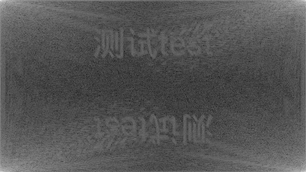
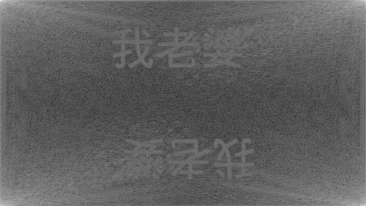
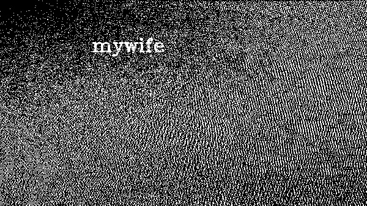
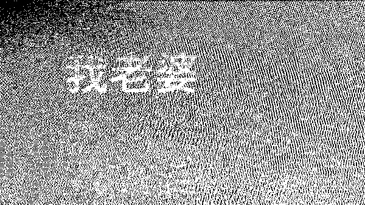

# BlindWatermark
  

在图片上加肉眼很难分辨的水印

* 原理
     * Encode:  
     原图 --- 变换 ---> 变换域 + 水印 --- 逆变换 ---> 带水印图
     * Decode(文字水印):  
     带水印图 --- 变换 ---> 变换域
     * Decode(图片水印):  
     原图 --- 变换 --> 原图变换域  
     带水印图 --- 变换 ---> 变换域 - 原图变换域

### Usage
    
    Usage: java -jar BlindWatermark.jar <commands> [args...]
        commands:
            encode <option> <image-src> <watermark-text> <image-encoded(text)>
            encode <option> <image-src> <watermark-image> <image-encoded(image)>
            decode <option> <image-encode(text)> <image-decode>
            decode <option> <image-src> <image-encoded(image)> <image-decode>
        options:
            -c discrete cosine transform
            -f discrete fourier transform
            -i image watermark
            -t text  watermark
        example:
            encode -ft input.png watermark output.png
### Build

	gradle build

### Demo

    原图:

    加文字水印(DFT):
    java -jar BlindWatermark.jar encode -ft gakki-src.png mywife gakki-dft-text-ec.png

    文字水印解码(DFT):
    java -jar BlindWatermark.jar decode -ft gakki-dft-text-ec.png gakki-dft-text-dc.png

    加图片水印(DFT):
    java -jar BlindWatermark.jar encode -fi gakki-src.png watermark.png gakki-dft-img-ec.png

    图片水印解码(DFT):
    java -jar BlindWatermark.jar decode -fi gakki-src.png gakki-dft-img-ec.png gakki-dft-img-dc.png

    加文字水印(DCT):
    java -jar BlindWatermark.jar encode -ct gakki-src.png mywife gakki-dct-text-ec.jpg

    文字水印解码(DCT):
    java -jar BlindWatermark.jar decode -ct gakki-dct-text-ec.jpg gakki-dct-text-dc.jpg

    加图片水印(DCT):
    java -jar BlindWatermark.jar encode -ci gakki-src.png watermark.png gakki-dct-img-ec.jpg

    图片水印解码(DCT):
    java -jar BlindWatermark.jar decode -ci gakki-src.png gakki-dct-img-ec.jpg gakki-dct-img-dc.jpg

### Reference

* [OpenCV  Discrete Fourier Transform](https://docs.opencv.org/3.4/d8/d01/tutorial_discrete_fourier_transform.html)

### License

    Copyright 2018 ww23(https://github.com/ww23/BlindWatermark).

    Licensed under the Apache License, Version 2.0 (the "License");
    you may not use this file except in compliance with the License.
    You may obtain a copy of the License at

         http://www.apache.org/licenses/LICENSE-2.0

    Unless required by applicable law or agreed to in writing, software
    distributed under the License is distributed on an "AS IS" BASIS,
    WITHOUT WARRANTIES OR CONDITIONS OF ANY KIND, either express or implied.
    See the License for the specific language governing permissions and
    limitations under the License.